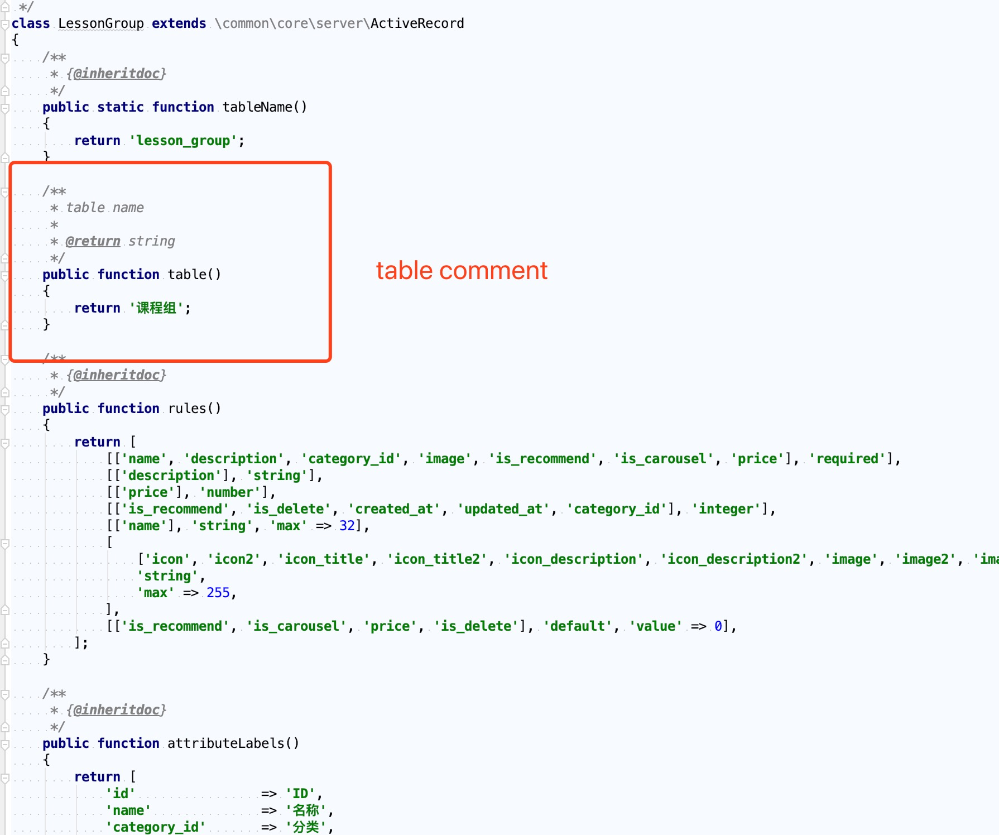

<p align="center">
    <a href="https://github.com/yiisoft" target="_blank">
        
    </a>
    <h1 align="center">Yii2 generate model</h1>
    <br>
</p>

This extension provides a Web-based code generator, called Gii, for [Yii framework 2.0](http://www.yiiframework.com) applications.
You can use Gii to quickly generate model. Refactor the code, add table comment

For license information check the [LICENSE](LICENSE.md)-file.


Installation
------------

The preferred way to install this extension is through [composer](http://getcomposer.org/download/).

Either run

```
composer require lengbin/yii-gii-model
```

or add

```
"lengbin/yii-gii-model": *
```

to the require-dev section of your `composer.json` file.


Usage
-----

Once the extension is installed, simply modify your application configuration at your `application\config\main_local.php` as follows:

```php
    $config['bootstrap'][] = 'gii';
    $config['modules']['gii'] = [
        'class'      => 'yii\gii\Module',
        'generators' => [
            'model' => [
                'class' => 'lengbin\gii\model\Generator',
            ],
            //...
        ],
    ];
    //...
```

You can then access Gii through the following URL:

```
http://localhost/path/to/index.php?r=gii
```

or if you have enabled pretty URLs, you may use the following URL:

```
http://localhost/path/to/index.php/gii
```

Screenshots
-----------



